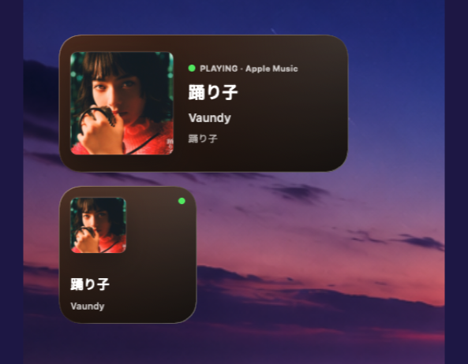
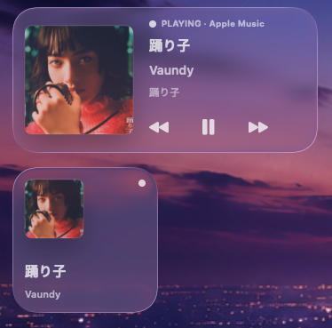

<div align="center">


# Now Playing Widget

### 把正在播放的音乐，放回 macOS 桌面。

支持网易云音乐、Apple Music 与 Spotify。
显示歌曲、歌手、专辑、封面、播放状态，并支持播放控制与自定义未播放页。

[](LICENSE)
[](https://www.apple.com/macos/)
[](https://developer.apple.com/documentation/widgetkit)
[](https://music.163.com/)
[](https://music.apple.com/)
[](https://www.spotify.com/)

</div>

---

## ✨ 这是什么？

**Now Playing Widget** 是一个 macOS 桌面音乐小组件。

它不是播放器，也不会接管你的音乐应用。
它只是把系统当前正在播放的音乐信息，整理成一张更适合放在桌面上的卡片。

<div align="center">

| 🎵 正在播放       | 🖼️ 封面背景     | 🕹️ 播放控制            |
| ------------- | ------------ | ------------------- |
| 歌曲、歌手、专辑、播放状态 | 根据封面生成深色渐变背景 | 播放 / 暂停 / 上一首 / 下一首 |

| 💤 未播放状态  | 🧩 小组件尺寸   | 🔒 本地数据     |
| --------- | ---------- | ----------- |
| 支持自定义显示图片 | 支持小号与中号小组件 | 不上传数据，无后端服务 |

</div>

---

## 🖼️ 效果预览

<table>
  <tr>
    <td align="center" width="50%">
      
      <br>
      <sub>网易云音乐</sub>
    </td>
    <td align="center" width="50%">
      
      <br>
      <sub>Apple Music</sub>
    </td>
  </tr>
  <tr>
    <td align="center" width="50%">
      
      <br>
      <sub>透明渲染模式</sub>
    </td>
    <td align="center" width="50%">
      
      <br>
      <sub>未播放状态</sub>
    </td>
  </tr>
</table>

---

## 🚀 快速开始

### 1. 安装依赖

```sh
brew install nowplaying-cli
```

项目默认读取：

```text
/opt/homebrew/bin/nowplaying-cli
```

如果你的 Homebrew 路径不同，可以先查看：

```sh
which nowplaying-cli
```

然后修改：

```swift
// App/NowPlayingReader.swift
private let executable = "/opt/homebrew/bin/nowplaying-cli"
```

---

### 2. 使用 Xcode 运行

1. 克隆本仓库；
2. 用 Xcode 打开 `NowPlayingWidget.xcodeproj`；
3. 分别选择 `NowPlayingWidget` 和 `NowPlayingWidgetExtension`；
4. 在 **Signing & Capabilities** 中设置自己的 Team；
5. 建议把两个 Bundle Identifier 改成自己的反向域名；
6. 构建并运行 `NowPlayingWidget`；
7. 播放网易云音乐、Apple Music 或 Spotify；
8. 在桌面右键进入「编辑小组件」，添加正在播放小组件。

运行后，菜单栏可以进行：

```text
立即刷新 / 打开数据目录 / 退出
```

---

## ⚙️ 配置

### 支持的播放器

```text
com.netease.163music
com.apple.Music
com.spotify.client
```

当前显示哪个播放器，取决于 macOS 系统当前暴露的正在播放信息。

---

### Widget 标识符

如果修改了 Widget Extension 的 Bundle Identifier，需要同步修改：

```swift
// Shared/NowPlayingShared.swift
static let widgetKind = "<your-widget-bundle-id>"
static let widgetBundleID = "<your-widget-bundle-id>"
```

---

### 数据目录

默认数据写入位置：

```text
~/Library/Containers/<widget-bundle-id>/Data/Library/Application Support/NowPlayingWidget/
```

里面主要有两个文件：

| 文件                | 作用                       |
| ----------------- | ------------------------ |
| `nowplaying.json` | 保存歌曲、歌手、专辑、播放状态、封面状态和背景色 |
| `cover.jpg`       | 保存当前歌曲封面                 |

---

## 🧠 实现简述

项目由一个菜单栏助手和一个 WidgetKit 小组件组成。

菜单栏助手负责读取 macOS 正在播放信息，并把歌曲数据写入本地文件；小组件读取这些文件后，在桌面上渲染正在播放卡片。

为了降低本地构建和签名配置成本，项目没有使用 App Group，而是直接写入 Widget Extension 的容器目录。因此修改 Widget Bundle Identifier 后，需要同步修改共享配置。

---

## 🛠️ 常见问题

<details>
<summary>小组件一直显示等待状态</summary>

请先确认：

1. 菜单栏助手正在运行；
2. 网易云音乐、Apple Music 或 Spotify 正在播放；
3. `nowplaying-cli` 可以正常读取信息；
4. 桌面上添加的是当前构建出来的小组件。

检查命令：

```sh
/opt/homebrew/bin/nowplaying-cli get-raw
```

查看写入的数据：

```sh
cat "$HOME/Library/Containers/<widget-bundle-id>/Data/Library/Application Support/NowPlayingWidget/nowplaying.json"
```

</details>

<details>
<summary>数据已经更新，但小组件没有变化</summary>

可以尝试：

1. 点击菜单栏助手里的 `立即刷新`；
2. 移除桌面上的旧小组件后重新添加；
3. 重启 WidgetKit 相关缓存：

```sh
killall chronod
killall NotificationCenter
```

</details>

<details>
<summary>如何查看封面是否正常写入？</summary>

```sh
sips -g pixelWidth -g pixelHeight "$HOME/Library/Containers/<widget-bundle-id>/Data/Library/Application Support/NowPlayingWidget/cover.jpg"
```

</details>

<details>
<summary>如何查看系统是否注册了小组件？</summary>

```sh
pluginkit -m -A -D -v -i <widget-bundle-id>
```

</details>

---

## ⚠️ 已知限制

* `nowplaying-cli` 依赖 macOS 的 MediaRemote 信息，系统更新后可能出现行为变化；
* 网易云音乐提供给系统的封面分辨率通常较低，常见约为 `100x100`；
* WidgetKit 有刷新预算和缓存策略，切歌后不一定立即刷新；
* 当前没有做播放器优先级选择，显示内容取决于 macOS 当前暴露的正在播放信息；
* 当前没有使用 App Group，修改 Widget Bundle Identifier 后需要同步修改配置。

---

## 🗺️ 后续计划

* [x] 自定义未播放状态显示图片
* [x] 播放 / 暂停 / 上一首 / 下一首控制
* [ ] 更多小组件样式
* [ ] 支持更多播放器
* [ ] 提供预编译安装包
* [ ] 更完善的设置界面
* [ ] 更稳定的刷新策略

---

## 📄 许可证

本项目基于 MIT License 开源，详情见 [LICENSE](LICENSE)。
