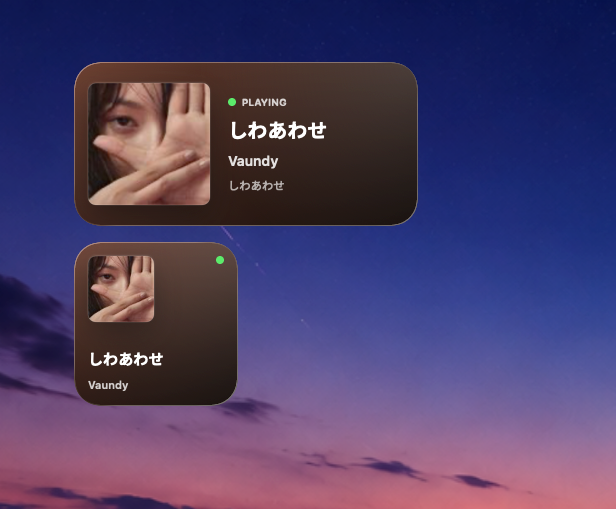

# Netease Now Playing Widget

一个面向 macOS 桌面的网易云音乐正在播放小组件。

它由一个菜单栏助手和一个 WidgetKit 小组件组成：菜单栏助手读取系统正在播放信息，写入本地 JSON 和封面文件；小组件读取这些数据，在桌面显示歌曲、歌手、专辑、播放状态和封面。小组件背景会根据封面主色自动生成深色渐变。


## 预览

中号小组件显示完整播放器卡片，小号小组件显示精简信息。



## 特性

- 显示网易云音乐当前歌曲、歌手、专辑、播放状态和封面。
- 根据封面平均色生成小组件背景。
- 支持 macOS 桌面小号和中号小组件。
- 菜单栏助手提供手动刷新、打开数据目录和退出。
- 不依赖 App Group，降低个人开发者签名配置成本。
- 没有后端服务，播放数据只写入本机小组件容器。

## 环境要求

- macOS 14 Sonoma 或更新版本
- Xcode
- Homebrew
- 网易云音乐 macOS 客户端
- `nowplaying-cli`

安装依赖：

```sh
brew install nowplaying-cli
```

默认读取路径是：

```text
/opt/homebrew/bin/nowplaying-cli
```

如果你的 Homebrew 不在 `/opt/homebrew`，需要修改 [App/NowPlayingReader.swift](App/NowPlayingReader.swift) 里的路径：

```swift
private let executable = "/opt/homebrew/bin/nowplaying-cli"
```

## 快速开始

1. 克隆仓库。
2. 用 Xcode 打开 `NeteaseNowPlayingWidget.xcodeproj`。
3. 选择 `NeteaseNowPlaying` target，在 Signing & Capabilities 中选择你自己的 Team。
4. 选择 `NeteaseMusicWidget` target，也设置同一个 Team。
5. 建议把两个 Bundle Identifier 改成你自己的反向域名。
6. 构建并运行 `NeteaseNowPlaying`。
7. 打开网易云音乐并播放歌曲。
8. 在桌面右键进入“编辑小组件”，添加小组件。

启动成功后，菜单栏会出现一个小图标。菜单包含：

- `立即刷新`
- `打开数据目录`
- `退出`

## 命令行构建

也可以用命令行构建。把 `<YOUR_TEAM_ID>` 替换成你的 Apple Developer Team ID：

```sh
xcodebuild \
  -project NeteaseNowPlayingWidget.xcodeproj \
  -scheme NeteaseNowPlaying \
  -configuration Release \
  DEVELOPMENT_TEAM=<YOUR_TEAM_ID> \
  build
```

构建产物会生成在 Xcode 的 DerivedData 目录中。**首次使用仍建议通过 Xcode 打开项目，检查签名、Bundle Identifier 和 Widget Extension 是否正常。**

## 配置

项目默认只处理网易云音乐：

```text
com.netease.163music
```

如果修改了 Widget Extension 的 Bundle Identifier，需要同步修改 [Shared/NowPlayingShared.swift](Shared/NowPlayingShared.swift)：

```swift
static let widgetKind = "<your-widget-bundle-id>"
static let widgetBundleID = "<your-widget-bundle-id>"
```

默认数据目录：

```text
~/Library/Containers/<widget-bundle-id>/Data/Library/Application Support/NeteaseNowPlaying/
```

主要文件：

- `nowplaying.json`：歌曲、歌手、专辑、播放状态、封面状态和背景色。
- `cover.jpg`：系统正在播放信息提供的封面图。

## 工作方式

项目包含两个 target：

- `NeteaseNowPlaying`：菜单栏助手，每 3 秒读取一次 `nowplaying-cli get-raw`。
- `NeteaseMusicWidget`：WidgetKit 扩展，读取本地 JSON 和封面文件并渲染小组件。

刷新流程：

1. 菜单栏助手轮询当前播放信息。
2. 当歌曲、歌手、专辑、播放状态、封面或背景色变化时，写入本地文件。
3. 写入后调用 `WidgetCenter` 请求刷新小组件 timeline。
4. WidgetKit 根据系统刷新策略更新桌面小组件。

## 排障

如果小组件一直显示等待状态，先确认：

1. 菜单栏助手正在运行。
2. 网易云音乐正在播放。
3. `nowplaying-cli` 可以正常读取正在播放信息。
4. 桌面上添加的是当前构建出来的“网易云音乐”小组件。

检查 `nowplaying-cli`：

```sh
/opt/homebrew/bin/nowplaying-cli get-raw
```

查看当前写入的数据：

```sh
cat "$HOME/Library/Containers/<widget-bundle-id>/Data/Library/Application Support/NeteaseNowPlaying/nowplaying.json"
```

查看封面尺寸：

```sh
sips -g pixelWidth -g pixelHeight "$HOME/Library/Containers/<widget-bundle-id>/Data/Library/Application Support/NeteaseNowPlaying/cover.jpg"
```

查看系统注册的小组件扩展：

```sh
pluginkit -m -A -D -v -i <widget-bundle-id>
```

如果数据文件已经更新，但桌面小组件没有变化，可以尝试：

1. 点击菜单栏助手里的 `立即刷新`。
2. 移除桌面上的旧小组件后重新添加。
3. 重启 WidgetKit 相关缓存：

```sh
killall chronod
killall NotificationCenter
```

## 已知限制

- `nowplaying-cli` 依赖 macOS 私有 MediaRemote 信息，系统更新后可能失效或行为变化。
- 网易云音乐提供给系统的封面通常分辨率较低，常见约为 `100x100`，因此小组件封面可能不如客户端内高清。
- WidgetKit 有刷新预算和缓存策略，切歌后不会像普通 App UI 一样毫秒级实时刷新。
- 当前只针对网易云音乐 macOS 客户端，没有做多播放器选择。
- 项目没有使用 App Group，因此修改 Widget Bundle Identifier 后必须同步修改代码里的容器路径常量。

## 许可证

MIT License. See [LICENSE](LICENSE) for details.
